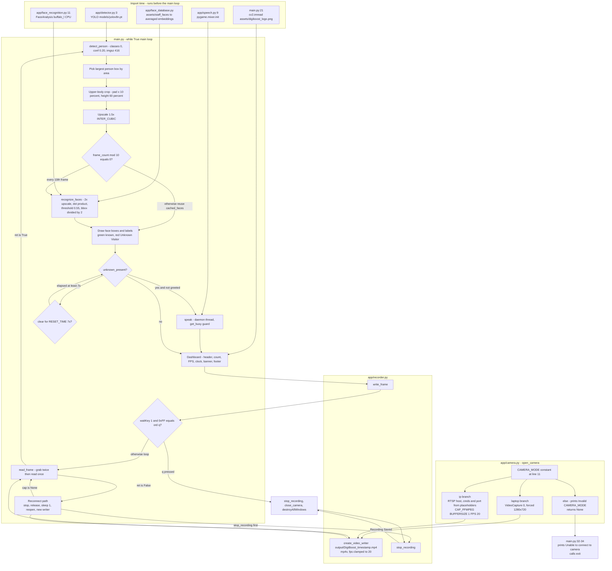

# DigiBoost AI Vision — Person Detection & Greeting System

Real-time person detection with YOLOv8, InsightFace identity matching, MP3 voice greeting, and automatic MP4 surveillance recording.


> **Version badge note:** `requirements.txt` contains only a single unpinned line (`ultralytics`). The versions above were read from the environment the project was last run in (`pip list --format=freeze`, `python 3.13.7`, Windows). They are *not* pinned by the repo — see [Configuration](#configuration).

---

## Table of Contents

- [Overview](#overview)
- [Features](#features)
- [Architecture](#architecture)
- [Tech Stack](#tech-stack)
- [Project Structure](#project-structure)
- [Setup Guide](#setup-guide)
- [Execution Guide](#execution-guide)
- [API Reference](#api-reference)
- [Configuration](#configuration)
- [Known Issues and Caveats](#known-issues-and-caveats)
- [Contributing](#contributing)
- [License](#license)

---

## Overview

A single-process desktop application that reads a live camera feed, detects people with YOLOv8, identifies the largest person in frame against a folder-based face database using InsightFace, and plays a spoken "Welcome to DigiBoost Institute of Technology" MP3 the first time an unknown visitor appears. Every annotated frame is written to a timestamped MP4 in `output/`, and a live OpenCV dashboard shows the person count, FPS, clock, and recognition results. The greeting is latched so it fires once per visitor and re-arms only after the scene has been clear for a configurable number of seconds.

---

## Features

Every item below is implemented in the current tree. Citations are `file:line`.

### Detection & recognition

| Feature | Implementation |
|---|---|
| Person detection restricted to COCO class `0`, confidence `0.20`, inference size `416` | `app/detector.py:5-15` |
| Only the **largest** person box in frame is cropped for recognition (largest by pixel area) | `main.py:127-147` |
| Upper-body crop: horizontal padding `10%` of box width, vertical extent `60%` of box height, clamped to frame bounds | `main.py:164-186` |
| Crop upscaled `1.5x` with `cv2.INTER_CUBIC` before recognition | `main.py:194-202` |
| Recognition throttled to **every 10th loop iteration**; results cached in `cached_faces` and re-drawn each frame | `main.py:208-212`, draw path `main.py:218-288` |
| InsightFace `buffalo_l` model on `CPUExecutionProvider`, `ctx_id=-1`, `det_size=(640, 640)` | `app/face_recognition.py:11-19` |
| Second internal `2.0x` upscale inside the recognizer, with `//= 2` on bbox coords to undo it | `app/face_recognition.py:43-49`, `app/face_recognition.py:80-86` |
| L2-normalized embedding + dot-product cosine match against every known identity | `app/face_recognition.py:57-75` |
| Similarity threshold `0.55`; below it the name is forced to `"Unknown"` | `app/face_recognition.py:25`, `app/face_recognition.py:77-78` |
| Per-identity averaged embedding built from multiple photos, then re-normalized | `app/face_database.py:68-79` |
| Unreadable images skipped (returns `None` from `cv2.imread`) — this is what keeps `desktop.ini` files in the dataset from breaking the load | `app/face_database.py:52-55` |
| Names formatted via `.replace("_", " ").title()` | `app/face_recognition.py:90` |
| Empty/None crop short-circuits to `[]` | `app/face_recognition.py:33-37` |

### Greeting

| Feature | Implementation |
|---|---|
| Greeting latched with a `greeted` flag so it fires **once** per visitor | `main.py:42`, `main.py:301-309` |
| Re-arms (`greeted = False`) only after the scene has been clear for `RESET_TIME = 7` seconds | `main.py:45`, `main.py:311-319` |
| Audio playback dispatched on a **daemon thread** so the capture loop never blocks | `app/speech.py:37-42` |
| Re-entrancy guard: `_play_audio` returns immediately if `pygame.mixer.music.get_busy()` | `app/speech.py:27-28` |
| MP3 asset | `assets/welcome.mp3` (referenced at `app/speech.py:15-18`) |

### Camera, recording & display

| Feature | Implementation |
|---|---|
| Two camera modes selected by a single constant: `laptop` (`VideoCapture(0)`, forced `1280x720`) and `ip` (RTSP over `CAP_FFMPEG`) | `app/camera.py:11`, `app/camera.py:18-50` |
| Latency mitigation: `read_frame` calls `cap.grab()` twice before a single `cap.read()` | `app/camera.py:59-65` |
| Auto-reconnect on a failed read: stop recording, release, `sleep(1)`, reopen, new writer, force welcome banner | `main.py:75-92` |
| Clean exit message if the camera cannot be opened at startup | `main.py:32-34` |
| Timestamped MP4 recording, filename `output/DigiBoost_%Y-%m-%d_%H-%M-%S.mp4` | `app/recorder.py:6-36` |
| Codec `mp4v`; source FPS clamped — if `fps <= 0 or fps > 120` it is forced to `20` | `app/recorder.py:19-22` |
| Graceful `None`-writer handling on every recorder call | `app/recorder.py:39-53` |
| Dark 80px header bar with `cv2.addWeighted` transparency blend | `main.py:335-351` |
| Header: 48x48 logo blit, `"DigiBoost AI Vision"`, green `ONLINE` dot, `People: N`, `FPS: N` | `main.py:356-422` |
| Person count in the HUD is the **YOLO box count**, not the number of recognized faces | `main.py:103-111`, `main.py:400-408` |
| Right-aligned clock formatted `%d %b %Y \| %I:%M:%S %p` | `main.py:428-447` |
| Green welcome banner `"Welcome to DigiBoost Institute of Technology"` shown for `WELCOME_DURATION = 3` seconds | `main.py:45-46`, `main.py:453-477` |
| Footer: `"Powered by Python \| YOLOv8 \| OpenCV"` and `"Press Q to Exit"` | `main.py:491-509` |
| Known faces drawn green with `name (NN%)`; unknown drawn red as `"Unknown Visitor"` | `main.py:243-262` |
| Label Y position clamped with `max(y1 - 10, 20)` so it never goes off-screen | `main.py:283` |

> **Not implemented / dead code:** `app/utils.py` defines `draw_box()` plus `BOX_COLOR`, `TEXT_COLOR`, and `LABEL_BG`, and `draw_box` is imported at `main.py:5` — but it is **never called anywhere in the repository**. Person bounding boxes are therefore *not* drawn on the output; only face boxes are. `person_found` is likewise assigned at `main.py:94`, `main.py:104`, and `main.py:111` but never read.

---

## Architecture

`main.py` is a **flat top-level script** — there is no `main()`, no function decomposition, and no `if __name__ == "__main__":` guard. It executes on import. All reusable logic lives in the `app/` package, which has **no `__init__.py`** and resolves via PEP 420 implicit namespace packages.

Two things happen at *import time* rather than at first use, which shapes the startup cost:

- `app/detector.py:3` — `YOLO("models/yolov8n.pt")` is constructed at module load.
- `app/face_database.py` — the entire face database is built and averaged when the module is imported, and it prints a loading banner to stdout.
- `app/speech.py:9` — `pygame.mixer.init()` runs at module load.
- `app/face_recognition.py:11` and `app/face_database.py:10` **each construct their own `FaceAnalysis("buffalo_l")` instance**, so the recognition model is loaded into memory twice per process.



**Control flow notes**

- The greeting is a latch, not a debounce. `greeted` flips to `True` on the first unknown sighting and only returns to `False` after the `unknown_present` branch has been skipped for `RESET_TIME` continuously (`main.py:311-319`).
- `no_person_start` is reset to `None` on every unknown sighting, so intermittent unknowns keep pushing the re-arm deadline out.
- `unknown_present` is only ever set `True` while drawing cached faces (`main.py:258`). Because recognition is throttled, this flag reflects a **cached** result, not a fresh one.
- `welcome_start` is initialised on the first loop iteration *before* the `ret` check (`main.py:72-73`), and set again on every unknown sighting, so the banner shows at startup and after each greeting.

---

## Tech Stack

| Technology | Version | Role |
|---|---|---|
| Python | 3.13.7 (verified interpreter; 3.13 bytecode present in `__pycache__`) | Runtime |
| [ultralytics](https://docs.ultralytics.com/) | 8.4.104 | YOLOv8 person detection |
| `models/yolov8n.pt` | nano weights, 6,549,796 bytes, **committed to the repo** | Detection weights |
| [opencv-python](https://pypi.org/project/opencv-python/) | 5.0.0.93 | Capture, drawing, `VideoWriter`, `imshow` |
| [insightface](https://github.com/deepinsight/insightface) | 1.0.1 | `FaceAnalysis` detection + 512-d embeddings |
| `buffalo_l` | auto-downloaded, **288,621,354 bytes** zip, cached to `~/.insightface/models/` | Face detection + recognition model |
| [onnxruntime](https://onnxruntime.ai/) | 1.28.0 | Inference backend, `CPUExecutionProvider` only |
| [numpy](https://numpy.org/) | 2.3.4 | L2 normalization, dot product, embedding averaging |
| [pygame](https://www.pygame.org/) | 2.6.1 | `pygame.mixer` MP3 playback |
| [torch](https://pytorch.org/) | 2.13.0 | Transitive dependency of ultralytics |
| `desktop.ini` in dataset | 2 files, hidden | Harmless — skipped by the `cv2.imread` `None` check at `app/face_database.py:54` |

There is **no** `pyproject.toml`, `setup.py`, `package.json`, or lockfile. Dependency declaration is a single unpinned line in `requirements.txt`.

---

## Project Structure

```text
Person_Detection_System/
├── main.py                       # Entry point. Flat top-level while-loop, no main guard.
├── requirements.txt              # Single unpinned line: "ultralytics"
├── LICENSE                       # MIT, (c) 2026 Emaan Ali
├── README.md                     # This file
├── .gitignore                    # Python template. Lines 219-221 ignore assets/, tests/, output/
│
├── app/                          # Application package (NO __init__.py - PEP 420 namespace pkg)
│   ├── camera.py                 # CAMERA_MODE switch, open_camera/read_frame/close_camera
│   ├── detector.py               # YOLO wrapper. Model loaded at import. detect_person()
│   ├── face_database.py          # Builds averaged embeddings from assets/staff_faces at import
│   ├── face_recognition.py       # InsightFace matching. recognize_faces()
│   ├── speech.py                 # speak() -> daemon thread -> _play_audio() -> assets/welcome.mp3
│   ├── recorder.py               # create_video_writer/write_frame/stop_recording -> output/
│   └── utils.py                  # draw_box() - IMPORTED BUT NEVER CALLED (dead code)
│
├── models/
│   └── yolov8n.pt                # 6.5 MB nano weights, tracked in git
│
├── assets/                       # GITIGNORED - will NOT exist on a fresh clone
│   ├── digiboost_logo.png        # 48x48 header logo
│   ├── welcome.mp3               # Greeting audio
│   └── staff_faces/              # Face DB: 7 identities, 46 images
│       ├── sir/                  (3 images)
│       ├── sir_abdul_salam/      (1 image)
│       ├── sir_ahmed_aftab_bhatti/ (3 images + desktop.ini)
│       ├── sir_imran_ali_awan/   (4 images)
│       ├── student1/             (8 images)
│       ├── student2/             (19 images + desktop.ini)
│       └── student3/             (8 images)
│
├── output/                       # GITIGNORED - recordings land here
│   └── DigiBoost_YYYY-MM-DD_HH-MM-SS.mp4
│
├── tests/                        # GITIGNORED - manual scripts, NOT automated tests
│   ├── __init__.py               # Empty (makes `python -m tests.X` work)
│   ├── test_yolo.py              # Loads YOLO, prints "YOLO Loaded Successfully!"
│   ├── test_tts.py               # BROKEN - calls speak() with an argument it does not accept
│   ├── test_recognition_video.py # Offline pipeline over a recorded MP4
│   ├── record_raw_video.py       # Records a raw clip for the offline test
│   └── videos/
│       ├── raw/known_student_ip.mp4
│       └── processed/known_student_upscaled_result.mp4
│
├── test_database.py              # Root script. Prints loaded identity names + count
├── test_face_recognition.py      # Root script. Minimal webcam recognition, ESC to exit
├── test_recognition.py           # Root script. Webcam recognition every 5 frames, q to exit
│
└── docs/
    └── .gitkeep                  # Placeholder only, no content
```

### Git tracking status — read this before cloning

`git ls-files` currently tracks only 24 paths. Four `.pyc` files under `app/__pycache__/` **are tracked** (`.gitignore` has `__pycache__/`, but they were committed before that rule and were never untracked). Meanwhile `assets/` and `tests/` are ignored, so a fresh clone contains **no face database, no audio, no logo, and no test scripts**.

---

## Setup Guide

### Prerequisites

- Python 3.13 (verified interpreter). 3.10+ should work; untested on other versions.
- A camera: a laptop webcam (default) or a reachable RTSP/IP camera.
- A desktop session with a display — `cv2.imshow` and `pygame.mixer.init()` both require one. **Headless Linux servers will fail at import.**
- ~300 MB of free disk for the auto-downloaded `buffalo_l` InsightFace model on first run.
- ~1 GB of free disk for PyTorch + ONNX Runtime.

### 1. Clone

```bash
git clone https://github.com/emaanali-cs/VisionSense-AI.git
cd VisionSense-AI
```

### 2. Install dependencies

`requirements.txt` is incomplete — it lists only `ultralytics`. The code also imports `cv2`, `insightface`, `pygame`, and `numpy`, so install those explicitly:

```bash
python -m venv .venv
# Windows
.venv\Scripts\activate
# Linux / macOS
source .venv/bin/activate

pip install -r requirements.txt
pip install opencv-python insightface onnxruntime pygame numpy
```

Verified reference versions from the environment this project was last run in:

```text
insightface==1.0.1      numpy==2.3.4        onnxruntime==1.28.0
opencv-python==5.0.0.93 pygame==2.6.1       torch==2.13.0
ultralytics==8.4.104
```

> `insightface` historically requires a build step and does not always publish wheels for new Python versions. If `pip install insightface` fails to build, this is the usual cause. It is **not pinned in the repo**, so a resolution failure is a real risk.

### 3. Restore the `assets/` directory — required

`assets/` is in `.gitignore` and is **not** in the repository. Without it the app cannot start:

- `app/face_database.py:37` calls `os.listdir("assets/staff_faces")` and raises `FileNotFoundError` at import.
- `app/speech.py:30` cannot load `assets/welcome.mp3`.
- `main.py:21` logs a missing logo (this one degrades gracefully — `logo` stays `None` and the blit at `main.py:356` is skipped).

You must supply these three paths yourself:

```text
assets/
├── digiboost_logo.png    # any PNG; resized to 48x48 at main.py:24
├── welcome.mp3           # any MP3
└── staff_faces/
    ├── <person_id_1>/    # folder NAME is the identity label
    │   ├── 01.png
    │   └── ...
    └── <person_id_2>/
```

Layout rules, straight from `app/face_database.py`:

- **One folder per person.** The folder name becomes the display name, later passed through `.replace("_", " ").title()` at `app/face_recognition.py:90`. So `sir_imran_ali_awan` displays as `Sir Imran Ali Awan`.
- **More photos per person = better accuracy.** All embeddings for an identity are averaged into a single vector (`app/face_database.py:71-79`), so a 1-photo identity is noticeably weaker than the 8–19 photo ones in this repo.
- Any image format `cv2.imread` supports (`.png`, `.jpg`, `.jpeg` are all present here).
- Non-image files are ignored safely — this is why the two `desktop.ini` files do no harm.
- Only `faces[0]` from each image is used (`app/face_database.py:63`), so **one face per photo**.
- A person folder where no face is detected in any image is dropped entirely, with a `No face found -> <filename>` line per image.

The local copy of this project has 7 identities across 46 images; `python test_database.py` prints `Loaded 7 people.`

### 4. Model weights

`models/yolov8n.pt` (6.5 MB) **is** committed, so nothing to download. InsightFace's `buffalo_l` is fetched automatically on first run into `~/.insightface/models/`.

### 5. Configure the camera

Open `app/camera.py` and edit the single constant at **line 11**:

```python
CAMERA_MODE = "laptop"   # or "ip"
```

- `"laptop"` → `cv2.VideoCapture(0)`, forces `1280x720` (`app/camera.py:26-27`).
- `"ip"` → builds an RTSP URL from the host, credentials, and port you set at `app/camera.py:35-37`, opened with `cv2.CAP_FFMPEG`; sets `CAP_PROP_BUFFERSIZE=1` and `CAP_PROP_FPS=20`.
- Anything else → prints `Invalid CAMERA_MODE` and returns `None`, which makes `main.py` print `Unable to connect to camera.` and exit.

There is **no `.env` file and no `.env.example`**, and the code reads no environment variables at all.

### 6. Verify the install

```bash
python test_database.py     # should print "Loaded 7 people." and list the identities
```

---

## Execution Guide

### Run the application

```bash
python main.py
```

Must be run **from the repository root** — `app/detector.py:3` uses the relative path `models/yolov8n.pt` and `app/face_database.py:24` uses `assets/staff_faces`.

Expected console output on a healthy start:

```text
Loading Face Database...
==================================================
Loading: sir
...
Loaded 7 people.
==================================================
Laptop webcam connected successfully.
==================================================
Recording Started
output/DigiBoost_2026-09-26_14-30-00.mp4
==================================================
```

**Controls** — verified against the source, not assumed:

| Input | Action | Source |
|---|---|---|
| `q` (lowercase) | Break the main loop, release camera, finalize the MP4, close windows | `main.py:526` — `cv2.waitKey(1) & 0xFF == ord("q")` |

That is the only binding in `main.py`. There are no other hotkeys, no CLI flags, no `--help`, and no config file argument. The on-screen footer reads `"Press Q to Exit"` (`main.py:503`), which is accurate for `q`; note it is **case-sensitive** — `Q` will not exit.

There is no graceful path for `Ctrl+C`; a `KeyboardInterrupt` will propagate and skip the `stop_recording` call at `main.py:533`, leaving the MP4 un-finalized.

### Test and utility scripts

**These are manual, interactive verification scripts. They contain no assertions, no fixtures, and no test framework — `pytest` is not installed and there is no `pytest.ini` or `conftest.py`.** Do not expect `pytest` to collect anything meaningful; the files are named `test_*.py` but are top-level scripts with side effects (camera access, window creation, disk writes).

| Command | Run from | What it does | Exit key |
|---|---|---|---|
| `python test_database.py` | repo root | Imports the face DB and prints every loaded identity plus `Total Faces: N`. No camera. | n/a, exits on its own |
| `python test_recognition.py` | repo root | Webcam + recognition, **no YOLO**. Recognizes on the whole frame every 5th frame (`test_recognition.py:44`). Draws `SAFE` / `UNKNOWN DETECTED`. | `q` (`:200`) |
| `python test_face_recognition.py` | repo root | Minimal webcam recognition, runs on **every** frame, all boxes green. | **`Esc`** / key code `27` (`:35`) — the only script that is not `q` |
| `python -m tests.test_recognition_video` | repo root | Offline pipeline: reads `tests/videos/raw/known_student_ip.mp4`, writes `tests/videos/processed/known_student_upscaled_result.mp4`. Falls back to `fps = 15` if the source reports `<= 0`. | `q` (`:305`) |
| `python -m tests.record_raw_video` | repo root | Records a raw clip to `tests/videos/raw/known_student_ip.mp4` for the above. Falls back to `1280x720` / `15` fps if the camera reports invalid values. | `q` (`:98`) |
| `python -m tests.test_tts` | repo root | ❌ **Currently broken** — see below. | n/a |
| `python test_yolo.py` | **`tests/`** | Loads YOLO and prints `YOLO Loaded Successfully!`. Uses the path `"../models/yolov8n.pt"` (`:3`), so it is written to be run from inside `tests/`. Running it from the repo root makes that path point *outside* the repository. | n/a |

**Use `python -m tests.<script>`, not `python tests/<script>.py`.** This is verified, not stylistic: from the repo root, `python tests\test_recognition_video.py` fails immediately with

```text
ModuleNotFoundError: No module named 'app'
```

because Python puts the *script's own directory* (`tests/`) on `sys.path`, not the current working directory. `tests/__init__.py` exists, so `python -m tests.test_recognition_video` resolves correctly from the root. The root-level `test_*.py` scripts have no such problem since they already sit at the root.

**`tests/test_tts.py` is broken.** It calls:

```python
speak("Welcome to DigiBoost Institute of Technology.")   # tests/test_tts.py:3
```

but `speak()` in `app/speech.py:37` takes **zero** parameters (confirmed: `inspect.signature(speak)` → `()`). This raises `TypeError: speak() takes 0 positional arguments but 1 was given`. It looks like a leftover from an earlier TTS design that was replaced by a pre-recorded MP3. Fix by calling `speak()`.

### There is no build step

No `setup.py`, `pyproject.toml`, or `Makefile` — nothing to build, bundle, or package. The `.gitignore` contains boilerplate `build/`/`dist/`/`*.spec` entries (the stock GitHub Python template), including a `# PyInstaller` section, but **no PyInstaller spec file or build script exists**. Treat those entries as unused template text.

---

## API Reference

There is **no HTTP/REST API, no server, no web UI, and no network listener** in this project. The complete public surface is the Python module interface below.

### `app.camera`

| Symbol | Signature | Behaviour |
|---|---|---|
| `CAMERA_MODE` | `str = "laptop"` | Module constant. `"laptop"` \| `"ip"`. Anything else → `open_camera()` returns `None`. |
| `open_camera()` | `() -> cv2.VideoCapture \| None` | Opens per `CAMERA_MODE`. Laptop: device `0` at `1280x720`. IP: RTSP via `CAP_FFMPEG`, `BUFFERSIZE=1`, `FPS=20`. Returns `None` on failure and prints a diagnostic. |
| `read_frame(cap)` | `(cap) -> (bool, ndarray)` | Calls `cap.grab()` **twice**, then `cap.read()` once. The discarded grabs cut latency at the cost of dropping source frames. |
| `close_camera(cap)` | `(cap) -> None` | `cap.release()` if not `None`, then `cv2.destroyAllWindows()`. |

### `app.detector`

| Symbol | Signature | Behaviour |
|---|---|---|
| `model` | `YOLO("models/yolov8n.pt")` | Constructed at **import time** (`app/detector.py:3`). |
| `detect_person(frame)` | `(frame: ndarray) -> list[Results]` | `model(frame, classes=[0], conf=0.20, imgsz=416, verbose=False)`. `classes=[0]` is COCO "person". |

### `app.face_database`

| Symbol | Type | Behaviour |
|---|---|---|
| `DATASET_PATH` | `str` | `os.path.join("assets", "staff_faces")` — **relative**, so cwd-dependent. |
| `known_faces` | `list[np.ndarray]` | One L2-normalized averaged embedding per identity, built at import. |
| `known_names` | `list[str]` | Folder names, parallel to `known_faces`. |

Import side effects: prints a `"=" * 50` banner, one `Loading: <name>` line per identity, a `No face found -> <file>` line per skipped image, and a final `Loaded N people.`

### `app.face_recognition`

| Symbol | Signature | Behaviour |
|---|---|---|
| `SIMILARITY_THRESHOLD` | `float = 0.55` | Below this, the name is forced to `"Unknown"` (`:77-78`). |
| `recognize_faces(person_crop)` | `(person_crop: ndarray \| None) -> list[dict]` | Returns `[]` for `None` or zero-size input. Upscales `2.0x` `INTER_CUBIC`, runs `FaceAnalysis.get()`, then for each face L2-normalizes the embedding, takes the argmax dot product over `known_faces`, applies the threshold, and divides bbox coords by `2` to undo the upscale. |

Each returned dict:

```python
{
    "name":       str,          # "Sir Imran Ali Awan", or "Unknown"
    "confidence": float,        # round(best_score, 2), range [-1.0, 1.0]
    "bbox":       (x1, y1, x2, y2),  # ints, in the coordinate space of the input crop
}
```

> `recognize_faces` returns **all** faces it detects in the crop, with no `top_k` or distance filtering. Callers are expected to have already narrowed the input down — `main.py` does this by cropping to the single largest person.

### `app.speech`

| Symbol | Signature | Behaviour |
|---|---|---|
| `AUDIO_FILE` | `str` | `os.path.join("assets", "welcome.mp3")`. |
| `speak()` | `() -> None` | **Takes no arguments.** Spawns a daemon thread running `_play_audio()`. |
| `_play_audio()` | `() -> None` | Returns immediately if `pygame.mixer.music.get_busy()`; otherwise loads and plays `AUDIO_FILE`. |

### `app.recorder`

| Symbol | Signature | Behaviour |
|---|---|---|
| `create_video_writer(cap)` | `(cap) -> cv2.VideoWriter` | `os.makedirs("output", exist_ok=True)`; filename `output/DigiBoost_%Y-%m-%d_%H-%M-%S.mp4`; `mp4v`; size and FPS read from `cap`, with FPS forced to `20` when `fps <= 0 or fps > 120`. |
| `write_frame(writer, frame)` | `(writer, frame) -> None` | No-op if `writer is None`. |
| `stop_recording(writer)` | `(writer) -> None` | `writer.release()` plus a `Recording Saved` banner. No-op if `writer is None`. |

### `app.utils` — dead code

| Symbol | Signature | Status |
|---|---|---|
| `BOX_COLOR` | `tuple = (0, 220, 120)` | Referenced only inside `draw_box`. |
| `TEXT_COLOR` | `tuple = (255, 255, 255)` | Referenced only inside `draw_box`. |
| `LABEL_BG` | `tuple = (45, 45, 45)` | Referenced only inside `draw_box`. |
| `draw_box(frame, box, confidence)` | `(frame, box, confidence) -> None` | Imported at `main.py:5` and **never called**. Expects a raw YOLO box (it does `box.xyxy[0]` internally) and draws a `Visitor | NN%` chip. |

---

## Configuration

All configuration is **hardcoded Python constants**. There is no `.env`, no `.env.example`, no YAML/JSON/TOML config, and `os.environ` is never read anywhere in the codebase.

| Constant | File:Line | Value | Effect |
|---|---|---|---|
| `CAMERA_MODE` | `app/camera.py:11` | `"laptop"` | Camera source. `"laptop"` \| `"ip"`; any other value makes `open_camera()` return `None`. **Edit this first.** |
| RTSP host / creds / port | `app/camera.py:35-37` | placeholders — `"type your ip camera address here"`, `[USERNAME]`, `[PASSWORD]`, `[Port Number]` | URL template is `f"rtsp://[USERNAME]:[PASSWORD]@{ip}:[Port Number]/unicast/c1/s0/live"`. Fill these in before using `CAMERA_MODE = "ip"`. |
| YOLO weights path | `app/detector.py:3` | `models/yolov8n.pt` | Relative. |
| `conf` / `imgsz` / `classes` | `app/detector.py:9-11` | `0.20` / `416` / `[0]` | Detection sensitivity, inference size, COCO person class. |
| `SIMILARITY_THRESHOLD` | `app/face_recognition.py:25` | `0.55` | Cosine similarity floor for an identity match. Raising it → more `Unknown`. |
| InsightFace model / provider | `app/face_recognition.py:11-19`, `app/face_database.py:10-18` | `buffalo_l`, `CPUExecutionProvider`, `ctx_id=-1`, `det_size=(640, 640)` | Duplicated in both modules. |
| `DATASET_PATH` | `app/face_database.py:24` | `assets/staff_faces` | Face DB location. Relative. |
| `AUDIO_FILE` | `app/speech.py:15-18` | `assets/welcome.mp3` | Greeting audio. |
| `RESET_TIME` | `main.py:45` | `7` | Seconds the scene must be clear before `greeted` re-arms. |
| `WELCOME_DURATION` | `main.py:46` | `3` | Seconds the green welcome banner stays on screen. |
| Recognition cadence | `main.py:208` | `frame_count % 10 == 0` | **Magic number, not a named constant.** Per loop iteration, not per source frame. |
| `UPSCALE` (pre-recognition) | `main.py:194` | `1.5` | Named constant. `INTER_CUBIC`. |
| Recognition upscale | `app/face_recognition.py:43-49` | `2.0` | **Magic number.** Undone by `//= 2` on the bbox at `:83-86`. |
| Crop padding / height | `main.py:164`, `main.py:180` | `0.10` width, `0.60` height | **Magic numbers.** |
| Latency grabs | `app/camera.py:60` | `2` | `for _ in range(2): cap.grab()`. |
| FPS fallback | `app/recorder.py:19-20` | `20` | Applied when `fps <= 0 or fps > 120`. |
| Recording filename | `app/recorder.py:10-12` | `output/DigiBoost_%Y-%m-%d_%H-%M-%S.mp4` | Timestamp format. |
| Laptop resolution | `app/camera.py:26-27` | `1280x720` | Requested, not guaranteed. |
| Header / footer geometry & colours | `main.py:335-509` | hardcoded | 80px header, 25px footer, `(35, 35, 35)`, green `(0, 220, 120)`, banner `(0, 120, 0)`. |
| Overlay text strings | `main.py:366,388,402,416,467,493,503,522` | hardcoded | `"DigiBoost AI Vision"`, `"ONLINE"`, `"People: N"`, `"FPS: N"`, `"Welcome to DigiBoost Institute of Technology"`, `"Powered by Python \| YOLOv8 \| OpenCV"`, `"Press Q to Exit"`, window title `"DigiBoost AI Person Detection System"`. |

### Declared but never used

- **`app/utils.py` in its entirety.** `draw_box` is imported at `main.py:5` and called nowhere. Person boxes are never rendered.
- **`person_found`** — assigned at `main.py:94`, `main.py:104`, and `main.py:111`, never read. `person_count` is what drives the HUD.
- **`.gitignore` boilerplate** — the `build/`, `dist/`, `*.spec`, and `# PyInstaller` sections are stock GitHub Python-template text. No packaging or PyInstaller configuration exists.
- **PyTorch / torchvision** are installed as ultralytics dependencies but the runtime inference path is ONNX Runtime (`CPUExecutionProvider`); torch is not called directly by this code.
- `LICENSE` is MIT and present. There is no `CONTRIBUTING.md`, no `CODE_OF_CONDUCT`, and no `SECURITY.md`.

---

## Known Issues and Caveats

Verified by reading the code and by running the safe parts of it. Items marked **unverified** were not executed.

**Functional**

1. **`assets/` and `tests/` are gitignored** (`.gitignore:219-220`), so a fresh clone cannot start — see [Setup step 3](#3-restore-the-assets-directory--required).
2. **`requirements.txt` is incomplete.** Only `ultralytics` is listed. `opencv-python`, `insightface`, `pygame`, and `numpy` are imported by the code but undeclared and unpinned.
3. **`tests/test_tts.py` raises `TypeError`** — calls `speak()` with an argument `speak()` does not accept.
4. **`python tests/<script>.py` fails with `ModuleNotFoundError: No module named 'app'`.** Use `python -m tests.<script>`.
5. **Person bounding boxes are never drawn.** `draw_box` is imported but unused.
6. **No `Ctrl+C` handling** — an interrupt skips `stop_recording()` and leaves the MP4 un-finalized.
7. **`exit conditions` are inconsistently implemented** across scripts: `q` everywhere except `test_face_recognition.py` (repo root), which uses key code `27` (`Esc`).
8. **The git remote URL embeds a GitHub Personal Access Token** (`https://ghp_...@github.com/emaanali-cs/VisionSense-AI.git`). **Rotate this token immediately** and switch the remote to a credential-free or SSH URL. It is not reproduced in this README.
9. **No `app/__init__.py`.** Importable only because Python 3.3+ namespace packages allow it. Fragile if the project is ever vendored or its layout changes.
10. **`FaceAnalysis("buffalo_l")` is instantiated twice** (`app/face_recognition.py:11` and `app/face_database.py:10`), doubling model load time and memory.
11. **Face images of real people are in the working tree** (46 images across 7 identities in `assets/staff_faces/`). They are correctly gitignored, but be deliberate about redistributing them.
12. **No CI, no tests, no linter, no formatter config.** Every `test_*.py` is an interactive script with side effects — camera access, GUI windows, disk writes. `pytest` would try to import them and would open a camera. There is nothing to run in CI as written.

**Behavioural notes**

13. **The HUD person count is a YOLO box count**, not a count of identified faces (`main.py:103-111`). With `read_frame` discarding 2 of every 3 source frames, the count and FPS reflect processed frames, not camera frames.
14. **The saved video is not a faithful capture.** `read_frame` drops two frames per iteration, so `output/*.mp4` is temporally sparse relative to the real camera stream.
15. **Recognition is throttled to every 10th iteration and results are cached** (`main.py:208-212`). Consequently `unknown_present` (`main.py:258`) and the greeting latch act on a **stale** result, and a face box can be drawn for up to 9 frames after the person has left.
16. **Only the single largest person is ever recognized** (`main.py:127-147`). A second, smaller person is counted in the HUD but never identified, and — because they are cropped out — will **not** trigger the greeting. Recognizable visitors standing behind others are silently missed.
17. **Averaging embeddings** (`app/face_database.py:71-79`) collapses a person's appearance variation into one vector. Identities with few or low-diversity photos — `sir_abdul_salam` has exactly one image — will match poorly. This is inherent to the design, not a bug.
18. **Every identity is matched in a linear scan** with no index (`app/face_recognition.py:63-75`). Fine at 7 identities; `O(n)` per face per recognition tick.
19. **The greeting fires for *unknown* faces, not *known* ones** (`main.py:243`, `main.py:297-305`). Staff and enrolled students are labelled on screen but never greeted. The banner text and audio therefore describe a visitor welcome, which is consistent, but it is the opposite of what the project name ("greeting system") may suggest.

**Unverified — flagged, not asserted**

20. **Mermaid diagram syntax is untested.** The `flowchart TD` block was written with every node label and subgraph title double-quoted to avoid parse errors from characters like `(640, 640)` and `[0]`, but it was not rendered through Mermaid. Please confirm it displays on GitHub.
21. **Python versions other than 3.13.7 are untested.** The README badge says 3.13+; only 3.13.7 was actually exercised.
22. **Non-Windows platforms are untested.** Everything was verified on Windows 11 with Python 3.13.7. Linux `apt` packages for GLib/GTK, ALSA/PulseAudio for `pygame.mixer`, and the `cv2.imshow` highgui backend are all unverified here. Headless operation is known not to work, since `cv2.imshow` and `pygame.mixer.init()` both need a display.
23. **The `ip` camera branch was not exercised.** Only `CAMERA_MODE = "laptop"` was run. RTSP connectivity, the `CAP_FFMPEG` path, and the credentials are untested.
24. **`main.py`'s live loop was not run end-to-end** (it blocks on a camera and a GUI). Its logic was verified by reading; the exact pixel output of the dashboard is unconfirmed.
25. **Face-match accuracy is unmeasured.** `SIMILARITY_THRESHOLD = 0.55` is a hardcoded constant with no evaluation harness, no ROC curve, and no ground-truth test set. Whether it is well-calibrated is unknown.
26. **`insightface` installability on a clean machine is unconfirmed.** Version `1.0.1` is installed here, but the repo pins nothing, and insightface is known to require a compiler on some Python/platform combinations.

---

## Contributing

There is no `CONTRIBUTING.md`. If you want to contribute, please open an issue or pull request on the [VisionSense-AI](https://github.com/emaanali-cs/VisionSense-AI) repository.

A few notes that will save you time:

- **Please do not commit face images or the `assets/` directory.** `.gitignore` already covers it; keep it that way.
- **`app/camera.py` line 11 is the switch you will want first** if you are testing on your own hardware.
- **Do not commit real camera credentials.** `app/camera.py:35-37` ships as placeholders; keep it that way, and prefer pulling the RTSP host and password into an env var if you touch that code.
- Real bugs worth filing: person boxes are never drawn, the `assets/` clone problem, the broken `tests/test_tts.py`, and the missing dependency declarations.

---

## License

**MIT License** — Copyright (c) 2026 Emaan Ali.

A complete [`LICENSE`](./LICENSE) file is present at the repository root and matches the standard MIT text. See [LICENSE](./LICENSE) for the full terms.
